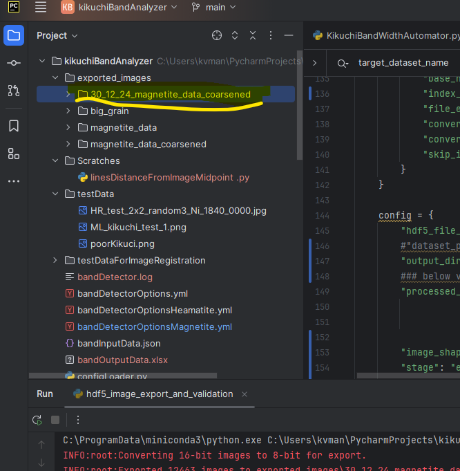
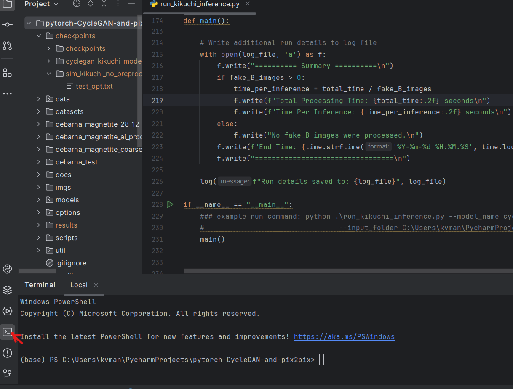
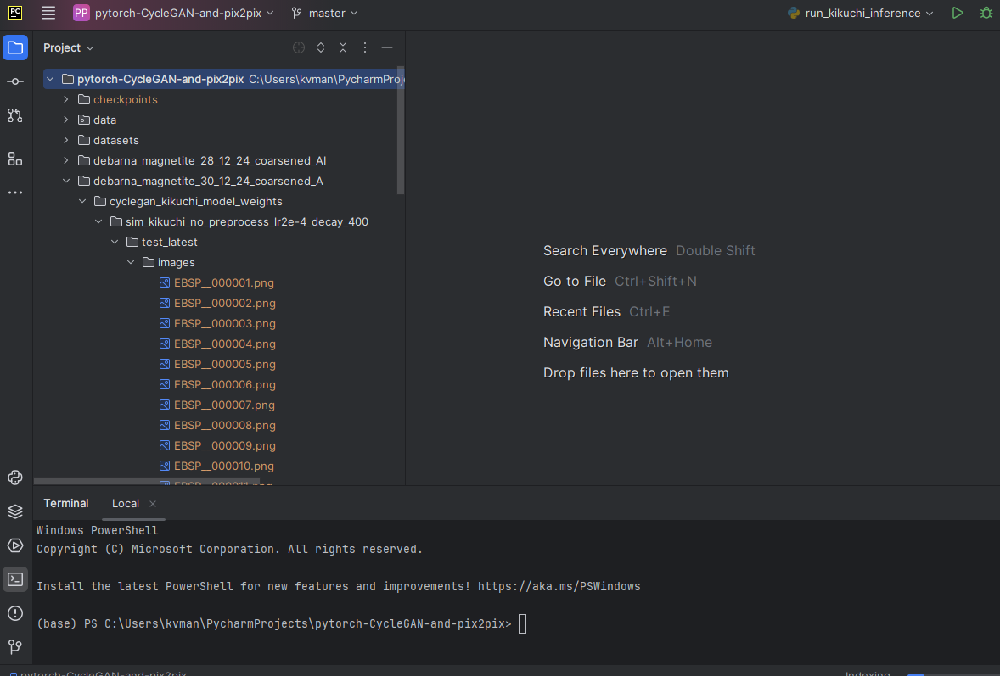

# How to Run the Analysis in PyCharm (Windows) — CycleGAN → EBSD Reconstruction → Band Widths

This guide is written for **beginners using Windows + PyCharm**. Every step also includes the **equivalent terminal command** (so you can still run everything from `cmd`/PowerShell/Linux terminal if you prefer). Terminal examples use `python`; on some Windows setups you may need to use `py` instead.

You will do four main things:

1. Export EBSD patterns from an `.oh5`/`.h5` into 8‑bit PNGs (`hdf5_image_export_and_validation.py` in this repo).
2. Run a CycleGAN model to enhance/denoise the PNGs (external CycleGAN repo).
3. Reconstruct the processed PNGs back into a new HDF5 file (`hdf5_image_export_and_validation.py` in this repo).
4. Run the band‑width pipeline using a YAML configuration (`KikuchiBandWidthAutomator.py` in this repo).

## Before you start (Lab computer)

On the lab computer, PyCharm + the Python environment are already set up for you. You do **not** need to configure the interpreter or install packages.

### Open the project (if it is not already open)

1. Start PyCharm.
2. Click **Open** (or **File → Open…**) and select the `kikuchiBandAnalyzer` folder.
3. In the left **Project** panel, you should see files like `KikuchiBandWidthAutomator.py` and `hdf5_image_export_and_validation.py`.

### (Optional) Quick sanity test (recommended)

Before doing the full CycleGAN workflow, confirm the repo runs on the included test data:

- In PyCharm: open `KikuchiBandWidthAutomator.py` and click the green **Run** triangle.
- In a terminal:

  ```bash
  python KikuchiBandWidthAutomator.py
  ```

If this fails (missing packages / interpreter errors), ask your lab admin/TA rather than changing PyCharm settings.

## Important note: PyCharm “Debug” vs repo `debug: true`

PyCharm has a **Debug** button that runs code under a debugger (breakpoints, step‑through, etc.).

This repo also has a YAML option `debug: true` which means: **run on a smaller/cropped subset for faster turnaround**. These are unrelated—don’t worry about the PyCharm Debug button unless you actually want to debug code.

## Assumptions and expectations (data layout)

- Your EBSD dataset exists as a matching pair in the same folder:
  - `sample.oh5` (or `sample.h5`)
  - `sample.ang`
- The HDF5 layout follows a common EDAX/TSL convention where patterns are stored under:
  - `/<scan_name>/EBSD/Data/Pattern`
  - The scripts in this repo automatically pick the first top‑level group that is not `Manufacturer` or `Version` and treat that as `<scan_name>`.
- The CycleGAN step must output PNGs with the **exact same filenames** as the exported inputs (e.g. `EBSP_000001.png`, `EBSP_000002.png`, …).

If any of the above is not true for your dataset, you may need to adapt the scripts or add a small conversion step.

## Step 1 — Prepare your input folder (HDF5 + ANG)

Put your `.oh5`/`.h5` and `.ang` in one directory (base name must match):

```
my_scan/
  sample.oh5
  sample.ang
```

Tip for beginners: create a new folder like `data/my_scan/` inside the repo so paths are easy to find from PyCharm.

## Step 2 — Export EBSD patterns to PNGs (export stage)

This repo provides `hdf5_image_export_and_validation.py` which exports the pattern dataset to individual PNG images.

### 2.1 Edit the export config (PyCharm)

1. In PyCharm, open `hdf5_image_export_and_validation.py`.
2. Scroll to the bottom to the `config = { ... }` block inside `if __name__ == "__main__":`.
3. Set these fields:
   - `hdf5_file_path`: path to your `.oh5`/`.h5`
   - `output_dir`: where PNGs will be written
   - `stage`: set to `"export"`

Example (Windows paths shown):

```python
config = {
    "hdf5_file_path": r"C:\path\to\sample.oh5",
    "output_dir": "exported_images/sample_export",
    "processed_image_dir": r"C:\path\to\processed\images",  # ignored in export stage
    "image_shape": (0, 0, 0),  # ignored in export stage
    "stage": "export",
    "options": {
        "base_name": "EBSP_",
        "index_format": "%06d",
        "file_extension": ".png",
        "convert_to_8bit": True,
        "convert_back_to_16bit": True,
        "skip_image_export": True,  # currently not used
    },
}
```

Windows path tip: use a raw string like `r"C:\...\file.oh5"` to avoid backslash issues.

### 2.2 Run the export (PyCharm)

1. Right‑click `hdf5_image_export_and_validation.py` in the **Project** panel.
2. Click **Run 'hdf5_image_export_and_validation'**.
3. Watch the **Run** tool window at the bottom for log output.

### 2.3 Run the export (terminal alternative)

```bash
python hdf5_image_export_and_validation.py
```

### 2.4 Verify the exported PNGs (use the screenshot)

After export, your `output_dir` should contain PNGs named like `EBSP_000001.png`, `EBSP_000002.png`, …

In PyCharm, locate the folder in the left **Project** panel (example shown here):



## Step 3 — Run CycleGAN inference on the exported PNGs

This step happens in your CycleGAN repo (not in this repo). The key requirement is:

- Input folder = the exported PNG folder from Step 2
- Output folder = PNG files **with the same filenames** as the input

### 3.1 Open a terminal inside PyCharm (use the screenshot)

If you like staying inside PyCharm, open the **Terminal** tool window:



Then `cd` into your CycleGAN repo and run your inference command there.

Because CycleGAN setups vary, follow your CycleGAN repo’s docs and/or run:

```bash
python run_kikuchi_inference.py --help
```

The processed images are typically placed under a folder such as:

`<results_dir>/<model_name>/test_latest/images`

After inference, confirm you see many PNGs (and that names match `EBSP_000001.png`, …):



### Windows note about multi‑line commands

If you see examples that use `\` to continue a command on the next line, those are for bash. In PowerShell use backticks (`` ` ``) or run the command as a single line.

## Step 4 — Reconstruct processed PNGs back into a new HDF5 file (reconstruct stage)

Now you will tell `hdf5_image_export_and_validation.py` where the processed images are and what the original image stack shape is.

### 4.1 Edit the reconstruct config (PyCharm)

In `hdf5_image_export_and_validation.py`, edit the `config = { ... }` block again:

- Set `stage` to `"reconstruct"`.
- Set `processed_image_dir` to the folder that directly contains `EBSP_000001.png`, …
- Set `image_shape` to the original pattern stack shape `(N, height, width)`.
  - You can get this from the original HDF5 dataset shape, or from your export step logs.

Here is what this edit looks like in PyCharm (example screenshot):


### 4.2 Run the reconstruct step (PyCharm)

Run the same script again:

1. Right‑click `hdf5_image_export_and_validation.py`
2. Click **Run 'hdf5_image_export_and_validation'**

### 4.3 Run the reconstruct step (terminal alternative)

```bash
python hdf5_image_export_and_validation.py
```

### 4.4 Confirm output HDF5

- A sibling file named `<original_stem>_AI_modified.h5` is written next to your input file.
- Even if the input file is `.oh5`, the script currently writes the reconstruction output using a `.h5` extension. If your downstream tools require `.oh5`, you can rename the extension (it remains standard HDF5).

## Step 5 — Copy/rename the `.ang` so the base name matches

The band‑width pipeline expects the `.ang` file to have the same base name as the HDF5 file you analyze.

Example:

- Output HDF5: `sample_AI_modified.h5`
- Required ANG: `sample_AI_modified.ang`

So copy your original `sample.ang` and rename it to `sample_AI_modified.ang` in the same folder.

## Step 6 — Run the band‑width analyzer (YAML‑driven)

### 6.1 Choose and edit a YAML options file

Pick an options file (or make a copy) such as:

- `bandDetectorOptionsMagnetite.yml`
- `bandDetectorOptionsHcp.yml`
- `bandDetectorOptionsDebug.yml` (useful for faster testing)

Edit it:

- Set `h5_file_path` to your reconstructed HDF5 path (e.g. `.../sample_AI_modified.h5`).
- Set `debug: true` (fast cropped run) or `debug: false` (full run).
- If you want to avoid GUI windows, set `skip_display_EBSDmap: true` and disable plotting options in the YAML.

### 6.2 Run the analyzer (PyCharm)

Simplest PyCharm approach (recommended for beginners):

1. Open `KikuchiBandWidthAutomator.py`
2. Find `def main():` near the bottom and change the config line from:

   ```python
   bwa = BandWidthAutomator()
   ```

   to (example):

   ```python
   bwa = BandWidthAutomator("bandDetectorOptionsMagnetite.yml")
   ```

3. Click the green **Run** triangle.

### 6.3 Run the analyzer (terminal alternatives)

Option A (edit `KikuchiBandWidthAutomator.py` to point at your YAML), then:

```bash
python KikuchiBandWidthAutomator.py
```

Option B (no edits; run with Python directly):

```bash
python -c "from KikuchiBandWidthAutomator import BandWidthAutomator; BandWidthAutomator('bandDetectorOptionsMagnetite.yml').run()"
```

## Expected outputs (what files you should see)

Given an input `.../sample_AI_modified.h5`, the automator writes outputs next to it:

- CSV summaries:
  - `sample_AI_modified_bandOutputData.csv`
  - `sample_AI_modified_filtered_band_data.csv`
- A copied/augmented HDF5 with computed datasets:
  - `sample_AI_modified_modified.h5`
- One or more derived `.ang` files with new columns appended:
  - `sample_AI_modified_modified_<suffix>.ang`

Derived HDF5 datasets written under `/<scan_name>/EBSD/Data/` include:
- `Band_Width`
- `psnr`
- `efficientlineIntensity`
- `defficientlineIntensity`
- `band_intensity_ratio`
- `band_intensity_diff_norm`
- `strain`
- `stress`

## Troubleshooting (common beginner issues)

- **Nothing happens / script can’t import packages**: PyCharm interpreter is wrong or dependencies aren’t installed; re-check Part 0.2 and Part 0.3.
- **Export writes to an unexpected folder**: check the *working directory* used by your run configuration; easiest fix is to make `output_dir` an absolute path.
- **“File not found” for PNGs during reconstruction**: `processed_image_dir` must point to the folder that directly contains `EBSP_000001.png`, … and filenames must match the exported names exactly.
- **Wrong `image_shape`**: reconstruction needs the exact `(N, height, width)` so it can rebuild the full stack.
- **GUI windows block the run**: set `skip_display_EBSDmap: true` and disable plotting options in the YAML.
- **Unexpected HDF5 layout**: your patterns may not be under `/<scan_name>/EBSD/Data/Pattern`; you will need to adapt the dataset path logic in the scripts.
