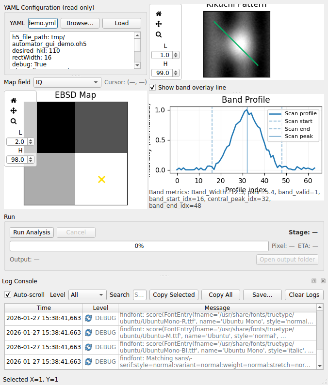

# Kikuchi BandWidth Automator GUI (User Guide)

This GUI is a **visualization-first** front-end for running the existing YAML-driven bandwidth pipeline (`KikuchiBandWidthAutomator.py`) without freezing the UI. It is designed for research workflows where users want to monitor progress and visually validate results at specific pixels.

## Key design principle

- **No parameter editing in the GUI.** All analysis parameters live in your YAML (`bandDetectorOptions*.yml`). The GUI only loads the YAML, validates it, and runs.

## Features (what you get)

- YAML browse + load + validation with friendly error dialogs
- EBSD map viewer (pick scalar field, percentile contrast, pan/zoom, cursor readout)
- Kikuchi pattern viewer for the selected pixel (percentile contrast, pan/zoom)
- Band profile plot (when `band_profile` outputs exist) with markers for:
  - `band_start_idx`, `central_peak_idx`, `band_end_idx`
- Worker-thread execution so the GUI never freezes
- Progress bar with stage labels + ETA
- Live “currently processing” pixel indicator on the map
- Cancel button (safe cancellation at stage boundaries / pixel boundaries)
- Log console (filter/copy) for diagnostics and reproducible reports
- Log console search + save-to-file for bug reports and proof artifacts
- Output summary + optional “Open output folder” button

## How to run

```bash
python -m kikuchiBandAnalyzer.automator_gui.main_window --config bandDetectorOptionsHcp.yml
```

## Step-by-step workflow

1) **Prepare your YAML**
   - Ensure `h5_file_path` points to your `.oh5` / `.h5` file.
   - Ensure `phase_list`, `hkl_list`, `desired_hkl`, `desired_hkl_ref_width`, `elastic_modulus` are set.
   - For faster iteration, set `debug: true` and choose `crop_start` / `crop_end`.

2) **Launch the GUI** (command above).

3) **Load YAML**
   - Click **Browse…** → choose YAML → click **Load**.
   - The GUI validates required keys and validates the input file has `/<scan>/EBSD/Data/Pattern`.

4) **Explore the scan visually**
   - Use the **Map field** dropdown to choose which scalar channel to display (IQ/CI/etc).
   - Click a pixel to update the pattern view.

5) **Run**
   - Click **Run Analysis**.
   - Watch stages:
     - Load/Validate → Indexing (kikuchipy) → Band detection/profiles → Write outputs
   - Use **Cancel** to stop safely.

6) **Inspect results**
   - After completion, the GUI opens the output file and enables:
     - Band profile plot + markers
     - Band overlay line on the pattern
     - Scalar band metrics (bandWidth/PSNR/etc)

## Output expectations

The pipeline writes outputs next to your input file (see `README.md` for details). New datasets required by downstream GUIs include:

- `band_profile`, `central_line`
- `band_start_idx`, `band_end_idx`, `central_peak_idx`, `profile_length`

Schema details live in `docs/data_formats.md`.

## Assumptions / prerequisites

- Your input file is a TSL/EDAX-style OH5/HDF5 with patterns stored at `/<scan_name>/EBSD/Data/Pattern`.
- Your YAML `phase_list` and `hkl_list` are physically meaningful for your material (used by the indexing stage).
- The analysis engine requires the dependencies in `requirements.txt` (notably `kikuchipy`, `hyperspy`, `PySide6`, and `h5py`).
- For large scans, prefer running in **debug mode** first (`debug: true`) to validate configuration and outputs on a cropped subset.

## How to verify

1) Run tests:

```bash
pytest -q
```

2) Generate a proof screenshot (offscreen-capable):

```bash
python scripts/run_automator_gui_demo.py --debug
```

This writes a PNG to `docs/screenshots/automator_gui_proof.png`.

## Screenshot


