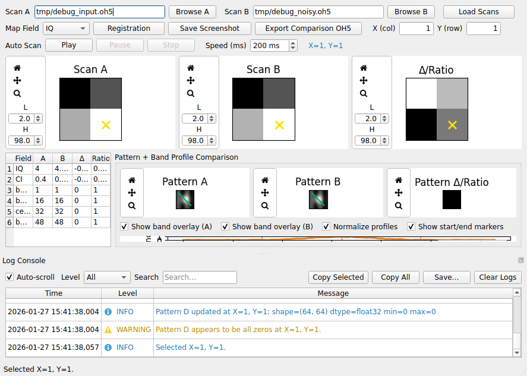

# EBSD Comparator: Band Profile Comparison (User Guide)

The EBSD Comparator GUI can now visualize the **exported band profiles** from Scan A and Scan B next to their respective Kikuchi patterns and overlay both profiles on shared axes for easy comparison.

## What this feature does

When you click a pixel:

1) The GUI shows **Pattern A** and **Pattern B** (existing behavior).
2) If band-profile datasets exist in the loaded OH5 files:
   - The GUI overlays the exported `central_line` on each pattern (toggleable).
   - The GUI plots `band_profile` for Scan A and Scan B on a shared plot (toggleable normalization).
   - The GUI draws vertical markers for:
     - `band_start_idx`, `band_end_idx`, and (if present) `central_peak_idx`.

## Required datasets

For band-profile visualization, each scan should provide these datasets under:

`/<scan_name>/EBSD/Data/`

- `band_profile` (float32, shape `(nPixels, profile_len)`)
- `central_line` (float32, shape `(nPixels, 4)`)
- `band_start_idx` (int32, shape `(nPixels,)`, `-1` when missing)
- `band_end_idx` (int32, shape `(nPixels,)`, `-1` when missing)
- `central_peak_idx` (int32, shape `(nPixels,)`, optional but recommended)
- `profile_length` (int32, shape `(nPixels,)`, recommended)

If the datasets are missing (older OH5 files), the GUI **does not crash**. It disables the profile panel and logs a warning.

Full schema details: `docs/data_formats.md`.

## Assumptions / prerequisites

- Scan A and Scan B are OH5/HDF5 files with scalar maps and patterns under `/<scan>/EBSD/Data/`.
- The band-profile comparison feature is automatically enabled only when `band_profile` exists.
- If scan alignment is active, Scan B band profiles are sampled using the same nearest-neighbor mapping as patterns.

## How to run

```bash
python -m kikuchiBandAnalyzer.ebsd_compare.gui.main_window --config configs/ebsd_compare_config.yml
```

## Step-by-step

1) Load Scan A and Scan B (`.oh5` files).
2) Click a pixel on any map (X = column, Y = row).
3) Inspect:
   - Pattern overlays (toggle “Show band overlay (A/B)”)
   - Profile plot (toggle normalization + marker visibility)
4) If the pixel has no valid band, the profile plot clears and the UI indicates “no valid band”.

## How to verify

Generate a proof screenshot (offscreen-capable):

```bash
python scripts/run_ebsd_compare_demo.py --debug
```

This writes a PNG to `docs/screenshots/ebsd_compare_band_profile_proof.png`.

## Screenshot


